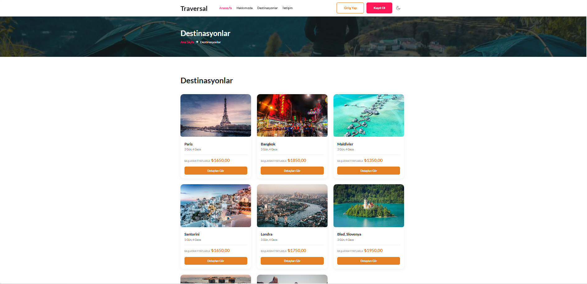

<div align="center">

# 🌍 Traversal

### ASP.NET Core 6 ile geliştirilmiş çok katmanlı seyahat & tur rezervasyon platformu

[](https://dotnet.microsoft.com/)
[](https://docs.microsoft.com/ef/)
[](https://www.microsoft.com/sql-server)
[](https://docs.microsoft.com/aspnet/core/security/authentication/identity)
[](https://dotnet.microsoft.com/apps/aspnet/signalr)
[](https://github.com/jbogard/MediatR)
[](https://automapper.org/)
[](https://fluentvalidation.net/)
[](https://github.com/ClosedXML/ClosedXML)
[](https://github.com/jstedfast/MailKit)

</div>

---

## 📖 İçindekiler

* [📌 Proje Hakkında](#-proje-hakkında)
* [📸 Ekran Görüntüleri](#-ekran-görüntüleri)
* [🛠️ Kullanılan Teknolojiler](#️-kullanılan-teknolojiler)
* [🏗️ Mimari](#-mimari)
* [✨ Özellikler](#-özellikler)
* [📦 Kurulum](#-kurulum)
* [📁 Proje Yapısı](#-proje-yapısı)
* [🎯 Öne Çıkan Özellikler](#-öne-çıkan-özellikler)

---

## 📌 Proje Hakkında

**Traversal**, seyahat acenteleri ve bireysel kullanıcılar için geliştirilmiş, **N-katmanlı mimari** üzerine kurulu full-stack bir web uygulamasıdır. SQL Server tabanlı ilişkisel veritabanı ile dinamik içerik yönetimi sunar; hem kullanıcı arayüzü hem de admin paneli tarafında eksiksiz çalışan işlevsel bir sistem sağlar.

> 🎯 Kullanıcılar tur listesini görüntüleyip rezervasyon yapabilir, admin panelinden tüm içerikler yönetilebilir, rezervasyon sonrası otomatik onay maili gönderilir ve admin paneli SignalR ile anlık istatistiklerle beslenir.

---

## 📸 Ekran Görüntüleri

### 🌍 Kullanıcı Arayüzü

<table>
<tr>
<td width="50%">

**Ana Sayfa**


</td>
<td width="50%">

**Ana Sayfa — Öne Çıkanlar**


</td>
</tr>

<tr>
<td width="50%">

**Ana Sayfa — Referanslar**


</td>
<td width="50%">

**Destinasyon Listesi**



</td>
</tr>

<tr>
<td width="50%">

**Destinasyon Detay**


</td>
<td width="50%">

**Destinasyon Detay — Devamı**


</td>
</tr>

<tr>
<td width="50%">

**Hakkımızda**


</td>
<td width="50%">

**Hakkımızda — Devamı**


</td>
</tr>

<tr>
<td width="50%">

**İletişim**


</td>
<td width="50%"></td>
</tr>
</table>

---

### 👤 Üye Paneli

<table>
<tr>
<td width="50%">

**Üye Dashboard**


</td>
<td width="50%">

**Profil Ekranı**


</td>
</tr>

<tr>
<td width="50%">

**Rezervasyon İşlemleri**


</td>
<td width="50%">

**Aktif Tur Listesi**


</td>
</tr>

<tr>
<td width="50%">

**Favori Destinasyonlar**


</td>
<td width="50%">

**Yorum Listesi**


</td>
</tr>
</table>

---

### 🛠️ Admin Paneli

<table>
<tr>
<td width="50%">

**Dashboard**


</td>
<td width="50%">

**SignalR — Anlık Veriler**


</td>
</tr>

<tr>
<td width="50%">

**Destinasyon Yönetimi**


</td>
<td width="50%">

**Rezervasyon Yönetimi**


</td>
</tr>

<tr>
<td width="50%">

**Kullanıcı Yönetimi**


</td>
<td width="50%">

**Rol Yönetimi**


</td>
</tr>
</table>

---

### ⚠️ Hata Sayfaları

<table>
<tr>
<td width="33%">

**401 - Yetkisiz**


</td>
<td width="33%">

**403 - Erişim Engellendi**


</td>
<td width="33%">

**404 - Sayfa Bulunamadı**


</td>
</tr>
</table>

---

## 🛠️ Kullanılan Teknolojiler

| Kategori                    | Teknoloji                                                              |
| --------------------------- | ---------------------------------------------------------------------- |
| **Backend**                 | ASP.NET Core MVC (.NET 6)                                              |
| **Veritabanı**              | SQL Server, Entity Framework Core                                      |
| **Kimlik Doğrulama**        | ASP.NET Core Identity, Cookie Authentication, Role-Based Authorization |
| **Nesne Eşleme**            | AutoMapper                                                             |
| **Doğrulama**               | FluentValidation                                                       |
| **Gerçek Zamanlı İletişim** | SignalR                                                                |
| **CQRS**                    | MediatR (Destinasyon modülünde uygulanmıştır)                          |
| **Mail Gönderimi**          | MailKit / MimeKit (SMTP)                                               |
| **Excel Raporlama**         | ClosedXML                                                              |
| **PDF İşlemleri**           | QuestPDF                                                               |
| **Frontend**                | HTML5, CSS3, JavaScript, jQuery                                        |
| **Dış API Entegrasyonu**    | RapidAPI (Döviz Kuru, Altın, Hava Durumu)                              |

---

## 🏗️ Mimari

Proje, **Generic Repository Pattern** temelli N-katmanlı mimari üzerine kurulmuştur:

```text
Traversal.EntityLayer      → Veritabanı varlıkları (Entities)

Traversal.DataAccessLayer  → Generic Repository Pattern, EF Core sorguları

Traversal.BusinessLayer    → Servisler, FluentValidation kuralları

Traversal.DtoLayer         → Data Transfer Object'ler

Traversal.WebUI            → MVC Controller'lar, View'lar, Area yapısı, CQRS/MediatR
```

### Mimari Prensipler

* 🧩 **N-Katmanlı Mimari** — Generic Repository Pattern ile DAL/Service ayrımı
* 🔐 **Area Yapısı** — Admin ve Member panelleri birbirinden bağımsız, izole modüller
* 🔄 **AutoMapper** — Entity ↔ DTO dönüşümlerinde tutarlı ve merkezi mapping yönetimi
* ✅ **FluentValidation** — İş kurallarının Business Layer'da, DTO'lardan bağımsız yönetimi
* 🧱 **ViewComponent Kullanımı** — Yeniden kullanılabilir, veri odaklı UI parçaları
* ⚡ **CQRS & MediatR** — Destinasyon modülü, Command/Query ayrımı ve MediatR pipeline'ı ile ayrıca geliştirilmiştir

### 🔀 CQRS / MediatR Kullanımı

Projede genel CRUD işlemleri klasik **Service Layer** yaklaşımıyla yönetilirken, **Destinasyon modülü** bilinçli olarak **CQRS (Command Query Responsibility Segregation)** prensibiyle, **MediatR** kütüphanesi kullanılarak ayrıca geliştirilmiştir.

```text
Traversal.WebUI/CQRS/

├── Command/      → Create/Update işlemlerini temsil eden komut nesneleri
├── Handler/      → Command/Query'leri işleyen handler sınıfları
└── Result/       → Query sonuçlarını taşıyan result nesneleri
```

* `IRequestHandler<TRequest, TResponse>` implementasyonları ile okuma (Query) ve yazma (Command) sorumlulukları ayrıştırılmıştır.
* Controller katmanı, `IMediator.Send(...)` üzerinden ilgili handler'a yönlendirme yapar.
* Bu yapı, aynı proje içinde hem klasik N-katmanlı mimarinin hem de CQRS yaklaşımının karşılaştırmalı olarak uygulanması amacıyla tercih edilmiştir.

---

## ✨ Özellikler

### 🌍 Kullanıcı Tarafı

* Dinamik ana sayfa: slider, öne çıkan destinasyonlar, istatistikler, referanslar
* Destinasyon detay sayfası: tur bilgisi, gün gün program, yorumlar, görsel galerisi
* Kullanıcı girişi zorunlu rezervasyon akışı
* Rezervasyon durumları: **Beklemede / Onaylandı / İptal**
* Rezervasyon sonrası otomatik SMTP onay maili
* Benzersiz `VIT-XXXXXXXX` rezervasyon kodu
* Favori destinasyon ekleme/listeleme
* Kullanıcı yorumu bırakma
* Admin onayı sonrası yorumların yayınlanması

### 🛠️ Admin Paneli

| Modül                         | İşlemler                                                      |
| ----------------------------- | ------------------------------------------------------------- |
| 🏖️ **Destinasyonlar**        | Listeleme, Ekleme, Güncelleme, Silme, **Excel'e Aktarma**     |
| 🖼️ **Vitrin İçerikleri**     | Öne Çıkan (Ana/Izgara), Bilgi Kartları                        |
| 🧑‍💼 **Rehberler**           | Listeleme, Ekleme, Güncelleme, Silme, **Excel'e Aktarma**     |
| ℹ️ **Hakkımızda / Neden Biz** | İçerik yönetimi                                               |
| ⭐ **Yorumlar**                | Listeleme, Onaylama, Silme                                    |
| 💬 **Referanslar**            | Listeleme, Ekleme, Güncelleme, Silme                          |
| ✉️ **Mesajlar**               | Okunan / Okunmayan mesaj yönetimi, otomatik okundu işaretleme |
| 📅 **Rezervasyonlar**         | Onaylama, İptal Etme, **Excel'e Aktarma**                     |
| 👥 **Kullanıcılar**           | Listeleme, Detay Görüntüleme, Silme, **Excel'e Aktarma**      |
| 🛡️ **Roller**                | Rol tanımlama, kullanıcıya rol atama                          |
| 📞 **İletişim Bilgileri**     | Site geneli iletişim bilgisi yönetimi                         |
| 📰 **Bülten Aboneleri**       | Abone listesi görüntüleme                                     |

---

## 📊 Anlık Veriler (SignalR)

Admin panelinde, **SignalR** ile gerçek zamanlı güncellenen istatistik paneli bulunur:

* Toplam destinasyon sayısı
* Toplam rezervasyon sayısı
* Toplam kullanıcı sayısı
* Toplam yorum sayısı
* Toplam favori sayısı
* Toplam referans sayısı
* Onaylanan rezervasyonlar
* Bekleyen rezervasyonlar
* İptal edilen rezervasyonlar
* Her 5 saniyede bir otomatik güncellenen canlı veri akışı

---

## 💱 Piyasa Verileri

**RapidAPI** entegrasyonu ile admin dashboard üzerinde:

* 💵 USD güncel döviz kuru
* 💶 EUR güncel döviz kuru
* 💷 GBP güncel döviz kuru
* 🪙 Gram altın fiyatı
* 🌤️ İstanbul hava durumu bilgisi

---

## 🔐 Kimlik Doğrulama & Yetkilendirme

* ASP.NET Core Identity ile kullanıcı kayıt/giriş sistemi
* Cookie tabanlı authentication
* Rol bazlı yetkilendirme (**Admin / Member**)
* Özelleştirilmiş Identity hata mesajları
* Türkçe hata mesajları
* Kullanıcıya özel profil yönetimi
* Profil fotoğrafı değiştirme
* Ad-soyad değiştirme
* Şifre değiştirme

---

## 📦 Kurulum

### 1. Projeyi Klonlayın

```bash
git clone https://github.com/EmreHaci03/Traversal.git
cd Traversal
```

### 2. Connection String'i Düzenleyin

`Traversal/Traversal.WebUI/appsettings.json` içerisindeki bağlantı dizesini kendi SQL Server ortamınıza göre düzenleyin:

```json
"ConnectionStrings": {
  "DefaultConnection": "Server=.;Database=TraversalDb;Trusted_Connection=True;"
}
```

### 3. Migration'ları Uygulayın

Visual Studio Package Manager Console üzerinden:

```powershell
Update-Database
```

> **Default Project:** `Traversal.WebUI`

### 4. Mail Ayarlarını Tanımlayın

`appsettings.json` içerisinde:

```json
"MailSettings": {
  "SenderName": "TraversalAdmin",
  "SenderEmail": "your@email.com",
  "SenderPassword": "your-app-password",
  "SmtpServer": "smtp.gmail.com",
  "Port": 587
}
```

> ⚠️ Gmail SMTP kullanıyorsanız normal hesap şifreniz yerine **Google Uygulama Şifresi (App Password)** kullanmanız gerekir.

### 5. RapidAPI Ayarlarını Tanımlayın

```json
"RapidApi": {
  "CurrencyKey": "your-currency-api-key",
  "GoldKey": "your-gold-api-key"
}
```

### 6. Projeyi Çalıştırın

```bash
dotnet run --project Traversal.WebUI
```

---

## 📁 Proje Yapısı

```text
Traversal/

├── Traversal.EntityLayer/
│   └── Entities/

├── Traversal.DataAccessLayer/
│   ├── Abstract/
│   ├── Concrete/
│   ├── EntityFramework/
│   └── Repository/

├── Traversal.BusinessLayer/
│   ├── Abstract/
│   ├── Concrete/
│   └── ValidationRules/

├── Traversal.DtoLayer/
│   └── DTOS/

└── Traversal.WebUI/
    ├── Areas/
    │   ├── Admin/
    │   └── Member/
    │
    ├── Controllers/
    ├── ViewComponents/
    ├── SignalRHub/
    │
    ├── CQRS/
    │   ├── Command/
    │   ├── Handler/
    │   └── Result/
    │
    ├── Extensions/
    └── Views/
```

---

## 🎯 Öne Çıkan Özellikler

* ✅ Tam fonksiyonel N-katmanlı mimari + CQRS/MediatR karşılaştırması
* ✅ Admin & Member panel ayrımı (Area Pattern)
* ✅ Gerçek zamanlı veri akışı (SignalR)
* ✅ Otomatik email bildirimi (rezervasyon onayı)
* ✅ FluentValidation ile merkezi doğrulama yönetimi
* ✅ Excel raporlama
* ✅ Destinasyon, Rezervasyon, Kullanıcı ve Rehber Excel çıktıları
* ✅ Dış API entegrasyonu
* ✅ Döviz, altın ve hava durumu verileri
* ✅ Responsive, modern arayüz tasarımı
* ✅ Rol bazlı erişim kontrolü
* ✅ ASP.NET Core Identity
* ✅ AutoMapper
* ✅ Generic Repository Pattern
* ✅ ViewComponent yapısı
* ✅ CQRS / MediatR
* ✅ SMTP / MailKit
* ✅ Özel tasarlanmış 401 / 403 / 404 hata sayfaları

---

<div align="center">

### 👤 Geliştirici

Bu proje, ASP.NET Core ile N-katmanlı mimari, Identity, AutoMapper, SignalR, CQRS/MediatR ve modern web teknolojilerini uygulamalı olarak öğrenmek amacıyla geliştirilmiştir.

</div>
